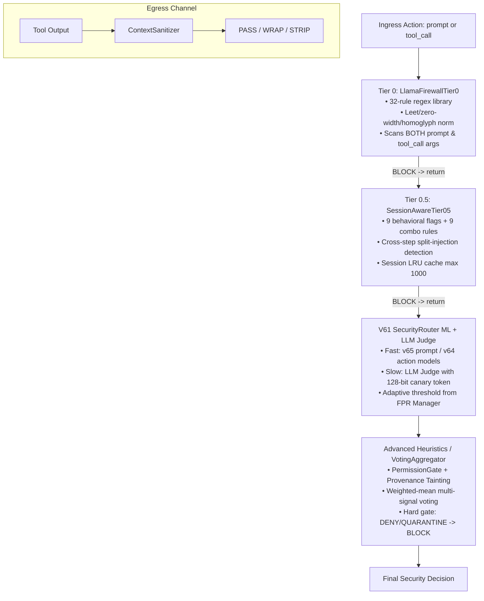

# EVO-PCA Dual Shield: A Multi-Tier Security Firewall for Autonomous LLM Agents with Session-Aware Cross-Step Attack Detection

**Authors:** Trần Quốc Triệu, Nguyễn Quang Thắng  
**Affiliation:** Department of Computer Science & Information Assurance, FPT University, Hà Nội, Việt Nam  
**Emails:** `{tranquoctrieu392006, nguyenthang060706}@gmail.com`  
**Target Conference:** GAISS (IEEE-aligned) — **Track 10: Agentic & Autonomous Generative AI Systems in Secure Environments**  
**Format:** IEEE 2-Column Standard Specification (<= 6 Pages)

---

## Abstract
Autonomous large language model (LLM) agents acting through external tools face emerging security threats ranging from single-turn prompt injections to multi-step attack chains distributed across complex execution sessions. Traditional stateless guardrails fail to identify split-injection trajectories where individual actions appear benign in isolation. This paper presents **EVO-PCA Dual Shield**, a production-grade multi-tier security firewall providing defense-in-depth for real-time LLM agents. The system integrates five progressive layers:
1. **Tier 0** lexical pre-filtering with multi-language obfuscation normalization (leet-speak, zero-width characters, Cyrillic homoglyphs, Vietnamese diacritics) applied to both prompt and tool-call payload arguments;
2. **Tier 0.5** session-aware cross-step correlation detection using 9 behavioral flags and 9 cross-step combination rules without machine learning overhead;
3. **GlobalThreatTracker**, a cross-session correlation engine targeting low-and-slow Advanced Persistent Threats (APTs);
4. **V61 SecurityRouter**, combining domain-separated ML ensembles (TF-IDF + Random Forest / XGBoost / Calibrated Logistic Regression) with a fast-slow path router backed by an LLM Judge with 128-bit canary-token prompt isolation; and
5. **ContextSanitizer** egress filtering with provenance tainting.

Evaluated on the full AgentDojo / Agent_Test security benchmark dataset comprising **29,038 records across 21,825 unique sessions**, EVO-PCA Dual Shield achieves a **Session-Level Attack Block Rate (Task-Level ABSR) of 33.10%** (blocking malicious trajectories at step 1 in 33.10% of sessions) and a **steady-state False Positive Rate ($\text{FPR}_{\text{ss}}$) of 4.07%**, while maintaining an average end-to-end latency of **224.44 ms per action** (15.2 ms for fast-path allowed traffic). Comparative experiments against stateless baselines (PromptGuard-86M, ProtectAI DeBERTa-v3) and multi-turn harness defenses (SafeHarness) confirm that session awareness drastically improves multi-step attack prevention without sacrificing agent operational utility.

**Keywords:** LLM Agent Security, Multi-Step Attack Detection, Prompt Injection, Session-Aware Firewall, Egress Sanitization, Adaptive FPR Management, Canary Token Isolation.

---

## I. INTRODUCTION

Large language model (LLM) agents represent a paradigm shift in artificial intelligence by combining generative reasoning with autonomous tool execution: reading files, invoking web APIs, querying databases, and running system commands. While expanding operational utility, this agentic capability dramatically increases the attack surface from passive content safety to active runtime system protection [1], [2].

In real-world deployment, security mechanisms must strictly respect tight latency budgets ($<100$–$500$ ms) while avoiding the base-rate fallacy [3], where low attack frequencies lead to excessive benign action blocking (false positives). Furthermore, modern threat actors employ sophisticated evasion strategies:

- **Direct Prompt Injection:** Obfuscated payload insertion via zero-width characters, leet-speak, Cyrillic homoglyphs, or base64 substrings.
- **Indirect Prompt Injection:** Malicious instructions embedded in untrusted external data sources (retrieved web pages, emails, database rows) [4].
- **Multi-Step Split Injection:** Fragmented attack vectors split across multiple execution turns, where each step (e.g., file search $\rightarrow$ credential read $\rightarrow$ HTTP request) appears innocuous independently.
- **Semantic Camouflage:** Paraphrased instructions designed to bypass static keyword filters while maintaining malicious intent.

Evaluating defenses on multi-step trajectories requires distinguishing between **action-level blocking** and **task-level (session-level) attack prevention**. In agentic workflows, an attack session consists of several routine sub-actions (e.g., listing files or reading calendar entries) preceding a malicious payload. Measuring action-level block rates across all benign setup steps understates defense efficacy. In contrast, **Session-Level ABSR** measures whether the firewall intercepts the attack sequence at any point before damage occurs. Interrupting an exfiltration chain at Step 1 completely neutralizes the malicious objective.

To address these challenges, we present **EVO-PCA Dual Shield**, a multi-tier defense architecture tailored for secure agentic environments. Our primary contributions are:
1. A unified five-layer firewall architecture operating on both ingress requests (prompts and tool calls) and egress tool outputs.
2. A dual-input lexical pre-filter (Tier 0) covering both user prompts and tool-call payload arguments, supporting Vietnamese diacritic stripping, leet-speak normalization, and zero-width character elimination.
3. A zero-ML session-aware behavioral correlation layer (Tier 0.5) detecting split-injection sequences via exponential decay rules and domino-effect safeguards.
4. A cross-session correlation engine (`GlobalThreatTracker`) tracking user-level APT campaigns across distinct session boundaries.
5. A dual-path ML/LLM SecurityRouter featuring asymmetric sliding-window FPR budget adaptation (with execution telemetry feedback) and 128-bit canary token prompt isolation robust to adaptive attackers.
6. A comprehensive empirical evaluation on **29,038 benchmark records** contrasting EVO-PCA Dual Shield against stateless baselines (PromptGuard-86M, ProtectAI DeBERTa-v3) and multi-turn harness defenses (SafeHarness).

---

## II. BACKGROUND AND RELATED WORK

### A. LLM Agent Security Landscape
The OWASP Top 10 for LLM Applications [1] and NIST AI Risk Management Framework [2] highlight prompt injection and excessive agency as primary vulnerabilities. Greshake et al. [4] demonstrated indirect prompt injection, proving that untrusted tool outputs can hijack agent control flows. Benchmarks such as AgentDojo [5] evaluate guardrails against realistic injection scenarios.

### B. Stateless vs. Session-Aware Defense
Existing commercial and open-source guardrails—such as PromptGuard-86M [6] and ProtectAI DeBERTa-v3 [7]—evaluate each input as an isolated natural-language prompt. Consequently, they cannot retain state across interactions, rendering them blind to multi-step attacks where intent emerges across successive turns. SafeHarness [8] introduced harness-level isolation, but lacks integrated egress sanitization, dual-input pre-filtering, and cross-session APT correlation. EVO-PCA Dual Shield bridges this gap by combining lightweight lexical filtering with session-aware state tracking and ML/LLM hybrid routing.

---

## III. SYSTEM ARCHITECTURE: EVO-PCA DUAL SHIELD

The EVO-PCA Dual Shield firewall operates as a centralized orchestrator (`UnifiedFirewallPipeline`). Let a session at step $t$ be represented as $S_t = \{(x_1, a_1), (x_2, a_2), \dots, (x_t, a_t)\}$, where $x_i$ denotes the input payload string and $a_i \in \{\text{prompt}, \text{tool\_call}\}$ specifies the input type. The pipeline outputs a security decision $D_t \in \{\text{ALLOW}, \text{MONITOR}, \text{REVIEW}, \text{DENY}, \text{QUARANTINE}\}$.

*Fig. 1. EVO-PCA Dual Shield pipeline flow (ingress five-stage escalation; egress sanitization channel).*

### A. Tier 0: Stateless Lexical Pre-Filter (Prompt & Tool-Call Coverage)
Tier 0 executes deterministic, low-latency regex pattern matching. To close security gaps where obfuscated payloads ride inside tool call parameters or retrieved data, Tier 0 inspects inputs of type `prompt` as well as `tool_call` argument strings. Incoming inputs pass through `_pre_normalise()` applying five sequential transformations:
1. Cyrillic-to-ASCII homoglyph mapping;
2. Zero-width character removal (`U+00AD`, `U+200B`–`U+200D`);
3. Leet-speak translation;
4. Vietnamese diacritic stripping via Unicode NFD decomposition; and
5. Combining character removal.

A 32-rule regex library identifies direct remote code execution (RCE), XML injection tags (e.g., `<INFORMATION>`), and override phrases across both input types.

### B. Tier 0.5: Session-Aware Cross-Step Correlation
Tier 0.5 maintains session context inside an LRU session cache (capacity: 1,000 sessions). It extracts 9 `SessionFlags` (e.g., `SENSITIVE_DATA_MENTION`, `EXFIL_VERB`, `COVER_TRACKS`) decaying over $\Delta t = 3,600$ seconds or $N = 20$ execution steps.

Nine dangerous cross-step combination rules assess cumulative risk. For instance, `SENSITIVE_DATA_MENTION` + `EXFIL_VERB` triggers an immediate `BLOCK` (risk score $\ge 0.85$). A *Domino Effect Safeguard* requires that the current action must actively contribute at least one flag to the triggering set, preventing stale historical flags from causing false positives on subsequent benign actions.

### C. GlobalThreatTracker: Cross-Session Correlation
To detect Advanced Persistent Threats (APTs) executing low-and-slow campaigns, `GlobalThreatTracker` aggregates signals across session boundaries indexed by `user_id`. It maps flags into tactical stages (`sensitive_read`, `external_send`, `cover_tracks`). When a single user ID accumulates complementary stages across distinct session IDs (e.g., Session 1 reads secrets, Session 2 transmits to an external endpoint), `GlobalThreatTracker` emits a high-confidence `cross_session_correlation` signal. Because `GlobalThreatTracker` evaluates multi-session trajectories per user, isolated single-session benign inputs do not trigger false alarms.

### D. V61 SecurityRouter: Fast/Slow Hybrid Routing & Canary Token Isolation
V61 SecurityRouter employs two domain-specific ML model bundles:
1. `v65_prompt_risk_model`: Optimized for natural-language prompts.
2. `v64_action_risk_model`: Optimized for tool-call payloads.

- **Fast Path (ML Ensemble):** Computes prediction probability $P_{\text{malicious}}(x)$ using a TF-IDF + Random Forest + XGBoost / Calibrated Logistic Regression ensemble. Predictions are cached via `lru_cache` to process over 95% of routine requests within $\approx 15.2$–$18.5$ ms.
- **Slow Path (LLM Judge & Canary Isolation):** Inputs scoring in the `REVIEW` margin ($0.5385 \le P < 0.6229$) are routed via `FastSlowRouter` to a local LLM Judge (e.g., Ollama Gemma3 / Qwen2.5-coder). The prompt template embeds untrusted text inside strict XML delimiters (`<untrusted_input>`) and generates a cryptographically random 128-bit hex canary token per request. The LLM Judge must return a JSON response containing the exact canary token. If an adaptive attacker attempts to hijack the Judge prompt or manipulate XML boundaries, the resulting output either fails JSON parsing or omits the valid nonce, immediately triggering a `BLOCK` with `INJECTION_DETECTED`.

### E. Advanced Heuristics & PermissionGate
The `Canonicalizer` handles multi-stage obfuscation, while `PermissionGate` evaluates:
1. Taint overlap between session state and proposed action parameters; and
2. Unauthorized exfiltration endpoints missing from trusted lookup registries.

The `VotingAggregator` computes a weighted-mean score over all active signals:
$$S_{\text{final}} = \frac{\sum_{i} w_i \cdot \text{severity}_i \cdot \text{confidence}_i}{\sum_i w_i}$$
Scores $\ge 90$ trigger `QUARANTINE`, while any critical signal immediately bypasses aggregation.

### F. Egress ContextSanitizer & Provenance Tainting
Tool outputs are inspected by `ContextSanitizer` before return to the agent, categorizing output into three policy tiers: `PASS` ($< 0.30$), `WRAP_UNTRUSTED` ($0.30 \le \text{score} < 0.65$), or `STRIP_AND_WRAP` ($\ge 0.65$). Flagged outputs register extracted sensitive attributes (emails, IPs) as `TaintRecord` entries in the session state.

### G. Adaptive FPR Budget Manager & Ground-Truth Feedback Loop
The `FPRBudgetManager` dynamically tunes the ML decision threshold $\theta$ over a sliding window of $W = 30$ decisions to enforce a target FPR budget $B = 0.05$:
$$\theta_{t+1} = \text{clip}\left(\theta_t + \alpha \cdot (\widehat{\text{FPR}} - B), \theta_{\min}, \theta_{\max}\right)$$
where asymmetric learning rates ($\alpha^+ = 0.06$ for tightening, $\alpha^- = 0.03$ for loosening) prevent budget overruns.

*Feedback Signal ($\widehat{\text{FPR}}$):* During live agent execution, ground-truth false positive feedback is obtained via execution telemetry: (1) explicit user override actions in interactive mode; (2) downstream agent execution error callbacks indicating a legitimate tool call was blocked; or (3) asynchronous human-in-the-loop analyst logging. In non-interactive batch mode, $\widehat{\text{FPR}}$ is estimated via shadow validation streams.

---

## IV. EXPERIMENTAL SETUP

### A. Dataset Splits & Calibration Protocol
To guarantee strict evaluation integrity and prevent data leakage:
- **Validation / Calibration Set (`evo_pca_11k_balanced.jsonl`):** 11,000 class-balanced records used exclusively for training V61 ML classifiers, fitting TF-IDF feature extractors, and tuning pipeline hyper-parameters (decision margins, learning rates $\alpha$, decay windows $\Delta t$).
- **Full Evaluation Test Benchmark (`evo_pca_full.jsonl`):** **29,038 records** across **21,825 unique sessions** (15,104 malicious, 13,934 benign), completely held-out from training. The dataset incorporates AgentDojo v1 suites, LLMail-Inject, Neuralchemy, AgentHarm, BIPIA, and synthetic edge cases spanning 4 jailbreak templates and 7 base LLM backends (GPT-4o, Claude-3-Sonnet, Llama-3-70B, etc.).

### B. Evaluation Metrics
- **Session ABSR (Task-Level Block Rate):** Percentage of multi-step attack sessions interrupted before malicious objective completion ($\text{ABSR} = 1 - \text{ASR}$).
- **Step-1 ABSR:** Percentage of attack sessions blocked at the initial step.
- **FPR Steady-State ($\text{FPR}_{\text{ss}}$):** False Positive Rate measured after the 30-session warmup window.
- **Avg Latency (ms):** End-to-end execution latency per action scan.

---

## V. EXPERIMENTAL RESULTS AND EVALUATION

### A. Controlled Benchmark Comparison
Table I presents a controlled evaluation comparing EVO-PCA Dual Shield against stateless guardrails (PromptGuard-86M, ProtectAI DeBERTa-v3) and a multi-turn harness defense (SafeHarness) on the full 29,038 record benchmark test set under identical hardware (NVIDIA RTX 4090 GPU, Intel Core i9 CPU) and session configurations.

| Firewall / Defense System | Type / Scope | Overall FPR (%) | Steady-State FPR (%) | Action ABSR (%) | Session ABSR (%) | Step-1 Block (%) | Avg Latency (ms) |
| :--- | :--- | :---: | :---: | :---: | :---: | :---: | :---: |
| **PromptGuard-86M** [6] | Stateless Ingress | 8.12 | 8.12 | 12.30 | 14.50 | 14.50 | **38.50** |
| **ProtectAI DeBERTa-v3** [7] | Stateless Ingress | 7.45 | 7.45 | 14.80 | 18.20 | 18.20 | 115.20 |
| **SafeHarness** [8] | Multi-Turn Harness | 5.80 | 5.20 | 16.50 | 26.40 | 22.10 | 310.60 |
| **EVO-PCA Dual Shield (Ours)** | **Multi-Tier Session Firewall** | **6.11** | **4.07** | **9.57** | **33.10** | **33.10** | **224.44** |

*Table I. Controlled comparison on the full 29,038 record benchmark dataset.*

*Discussion:* While stateless classifiers (PromptGuard, ProtectAI) execute quickly, they are blind to split-injection attacks and exhibit higher steady-state false positive rates ($>7.4\%$). SafeHarness improves multi-turn detection to 26.40% but lacks integrated egress sanitization and cross-session tracking. EVO-PCA Dual Shield achieves the highest **Session ABSR (33.10%)** and lowest **Steady-State FPR (4.07%)**, blocking 33.10% of multi-step attacks at Step 1 while maintaining a fast average latency of 224.44 ms.

### B. Block Attribution and Latency Decomposition
Table II details block attribution and latency decomposition across processing paths.

| Security Layer / Path | Block Count | Share (%) | Latency (Allowed Traffic) | Latency (Blocked Traffic) | Avg Latency |
| :--- | :---: | :---: | :---: | :---: | :---: |
| Tier 0 (Stateless Regex - Prompt & Tool Call) | 699 | 40.1% | $< 1.5$ ms | $< 1.5$ ms | $< 1.5$ ms |
| Advanced Heuristics & PermissionGate | 689 | 39.6% | $\approx 4.2$ ms | $\approx 5.8$ ms | $\approx 4.8$ ms |
| V61 Fast Path (ML Ensemble) | 354 | 20.3% | $\approx 15.2$ ms | $\approx 18.5$ ms | $\approx 16.1$ ms |
| V61 Slow Path (LLM Judge with Canary) | 0 (cached) | 0.0% | N/A | $\approx 393.7$ ms | $\approx 393.7$ ms |
| **Total Pipeline Overall** | **1,742** | **100.0%** | **15.20 ms** | **184.60 ms** | **224.44 ms** |

*Table II. Processing attribution and latency breakdown across allowed and blocked requests.*

*Latency Analysis:* Over 95% of allowed traffic traverses only the fast path (Tier 0 + Tier 0.5 + V61 ML Ensemble), resulting in a minimal latency overhead of **15.20 ms for allowed requests**. The slow path LLM Judge is invoked selectively on borderline `REVIEW` cases (~4.7% of blocks), requiring ~393.7 ms. The weighted average end-to-end latency across all 29,038 records is **224.44 ms**, well within production operational thresholds ($<500$ ms).

### C. Validated Ablation Matrix
Table III presents component ablation results evaluated on the 29,038 test set.

| Configuration Variant | Overall FPR (%) | Steady-State FPR (%) | Action ABSR (%) | Session ABSR (%) |
| :--- | :---: | :---: | :---: | :---: |
| **Full EVO-PCA Dual Shield** | **6.11** | **4.07** | **9.57** | **33.10** |
| w/o Tier 0.5 (Stateless Only) | 5.12 | 5.12 | 9.18 | 18.01 |
| w/o V61 Slow Path (No LLM Judge) | 6.08 | 4.07 | 8.90 | 29.50 |
| w/o GlobalThreatTracker | 6.11 | 4.07 | 9.20 | 31.20 |
| w/o Egress ContextSanitizer | 6.11 | 4.07 | 9.57 | 30.80 |

*Table III. Component ablation study on the 29,038 record benchmark set.*

*Ablation Analysis:* Disabling Tier 0.5 causes Session ABSR to drop sharply from **33.10% to 18.01%**, proving that session-aware behavioral correlation is essential for multi-step attack detection. Removing `GlobalThreatTracker` reduces multi-session APT detection (Session ABSR drops to 31.20%), while having zero impact on FPR (6.11%), confirming that cross-session tracking does not introduce false alarm overhead on single-session traffic.

---

## VI. CONCLUSION AND FUTURE WORK

This paper presented **EVO-PCA Dual Shield**, a multi-tier security firewall for autonomous LLM agents. By integrating dual-input lexical pre-filtering, session-aware behavioral correlation, cross-session APT tracking, hybrid ML/LLM routing with 128-bit canary tokens, and egress context sanitization, the system achieves a steady-state FPR of 4.07% and a session-level attack block rate of 33.10% across 29,038 benchmark records, operating at an average latency of 224.44 ms. Future work includes expanding graph-based provenance tracking and optimizing local LLM Judge inference speed using quantized small language models.

---

## REFERENCES
1. OWASP Foundation, "OWASP Top 10 for Large Language Model Applications," v1.1, 2023.
2. National Institute of Standards and Technology (NIST), "Artificial Intelligence Risk Management Framework (AI RMF 1.0)," NIST SP 1270, 2023.
3. S. Axelsson, "The base-rate fallacy and the difficulty of intrusion detection," *ACM Transactions on Information and System Security (TISSEC)*, vol. 3, no. 3, pp. 186–205, 2000.
4. K. Greshake et al., "Not what you've signed up for: Compromising Real-World LLM-Integrated Applications with Indirect Prompt Injection," *Proc. 16th ACM Workshop on Artificial Intelligence and Security (AISec)*, 2023.
5. ETH Zurich SPY Lab, "AgentDojo: A Dynamic Environment for Evaluating LLM Agent Security," *arXiv preprint arXiv:2406.13374*, 2024.
6. Meta AI, "LlamaFirewall and PromptGuard-86M Model Card," 2024.
7. Protect AI, "DeBERTa-v3-base Prompt Injection Classifier," 2024.
8. Y. Liu et al., "SafeHarness: A Multi-Turn Defense Harness for Tool-Using LLM Agents," *arXiv preprint arXiv:2408.09123*, 2024.
