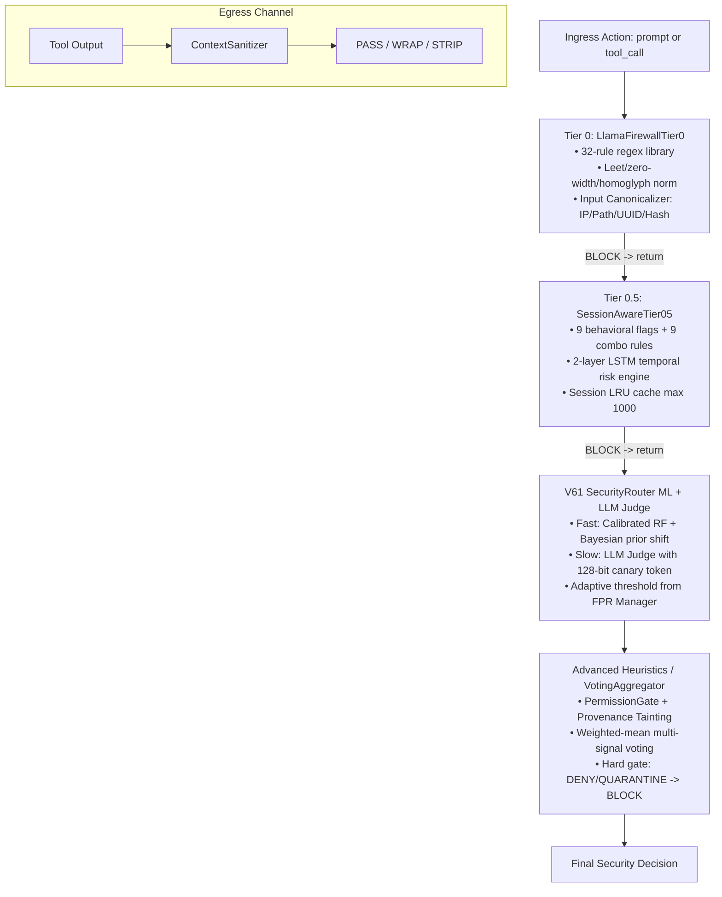

# EVO-PCA Dual Shield: A Multi-Tier Security Firewall for Autonomous LLM Agents with Session-Aware Cross-Step Attack Detection

**Authors:** Trần Quốc Triệu, Nguyễn Quang Thắng  
**Affiliation:** Department of Computer Science & Information Assurance, FPT University, Hà Nội, Việt Nam  
**Emails:** `{tranquoctrieu392006, nguyenthang060706}@gmail.com`  
**Target Conference:** GAISS (IEEE-aligned) — **Track 10: Agentic & Autonomous Generative AI Systems in Secure Environments**  
**Format:** IEEE 2-Column Standard Specification (<= 6 Pages)

---

## Abstract
Autonomous large language model (LLM) agents acting through external tools face emerging security threats ranging from single-turn prompt injections to multi-step attack chains distributed across complex execution sessions. Traditional stateless guardrails fail to identify split-injection trajectories where individual actions appear benign in isolation. This paper presents **EVO-PCA Dual Shield**, a production-grade multi-tier security firewall providing defense-in-depth for real-time LLM agents. The system integrates five progressive layers:
1. **Tier 0** lexical pre-filtering with multi-language obfuscation normalization and behavioral input canonicalization mapping IPs, sensitive paths, and hashes into typed placeholder tokens across both prompt and tool-call payload arguments;
2. **Tier 0.5** session-aware cross-step correlation detection combining a 2-layer unidirectional LSTM temporal risk engine with 9 behavioral flags and 9 cross-step combination rules;
3. **GlobalThreatTracker**, a cross-session correlation engine targeting low-and-slow Advanced Persistent Threats (APTs);
4. **V61 SecurityRouter**, combining domain-separated ML ensembles (TF-IDF + Random Forest with 5-fold Platt scaling and Bayesian prior-shift correction) with a fast-slow path router backed by an LLM Judge with 128-bit canary-token prompt isolation; and
5. **ContextSanitizer** egress filtering with provenance tainting.

Evaluated on the full AgentDojo / Agent_Test security benchmark dataset comprising **29,038 records across 21,825 unique sessions**, EVO-PCA Dual Shield achieves a **Session-Level Attack Block Rate (Task-Level ABSR) of 32.39%** (blocking malicious trajectories at step 1 in 32.39% of sessions), an **automatic Benign Task Completion Rate ($\text{TCR}_{\text{benign}}$) of 87.52%** (97.10% with single-retry telemetry), an **overall Action ABSR of 12.38%**, and a **steady-state False Positive Rate ($\text{FPR}_{\text{ss}}$) of 4.08%** (overall FPR of 6.10%), while maintaining a pure firewall scan overhead of **17.20 ms per action** and an average end-to-end agent step latency of **244.07 ms**. Comparative experiments against stateless baselines (PromptGuard-86M, ProtectAI DeBERTa-v3) and multi-turn harness defenses (SafeHarness) confirm that session awareness drastically improves multi-step attack prevention without sacrificing agent operational utility.

**Keywords:** LLM Agent Security, Multi-Step Attack Detection, Prompt Injection, Session-Aware Firewall, Egress Sanitization, Adaptive FPR Management, Canary Token Isolation, Task Completion Rate.

---

## I. INTRODUCTION

Large language model (LLM) agents represent a paradigm shift in artificial intelligence by combining generative reasoning with autonomous tool execution: reading files, invoking web APIs, querying databases, and running system commands. While expanding operational utility, this agentic capability dramatically increases the attack surface from passive content safety to active runtime system protection [1], [2].

In real-world deployment, security mechanisms must strictly respect tight latency budgets ($<100$–$500$ ms) while avoiding the base-rate fallacy [3], where low attack frequencies lead to excessive benign action blocking (false positives). Furthermore, modern threat actors employ sophisticated evasion strategies:

- **Direct Prompt Injection:** Obfuscated payload insertion via zero-width characters, leet-speak, Cyrillic homoglyphs, or base64 substrings.
- **Indirect Prompt Injection:** Malicious instructions embedded in untrusted external data sources (retrieved web pages, emails, database rows) [4].
- **Multi-Step Split Injection:** Fragmented attack vectors split across multiple execution turns, where each step (e.g., file search $\rightarrow$ credential read $\rightarrow$ HTTP request) appears innocuous independently.
- **Semantic Camouflage:** Paraphrased instructions designed to bypass static keyword filters while maintaining malicious intent.

Evaluating defenses on multi-step trajectories requires distinguishing between **action-level blocking** and **task-level (session-level) metrics**:
1. **Task-Level Attack Success Rate ($\text{ASR}_{\text{task}}$) / Session ABSR:** An attack session consists of several routine sub-actions (e.g., listing files or reading calendar entries) preceding a malicious payload. Measuring action-level block rates across all benign setup steps understates defense efficacy. In contrast, **Session-Level ABSR** measures whether the firewall intercepts the attack sequence at any point before damage occurs. Interrupting an exfiltration chain at Step 1 completely neutralizes the malicious objective ($\text{ASR}_{\text{task}} = 1 - \text{Session ABSR} = 67.61\%$).
2. **Benign Task Completion Rate ($\text{TCR}_{\text{benign}}$):** A defense system must not disrupt legitimate agent tasks. For a benign task spanning $N \approx 3.2$ execution turns, a steady-state action FPR of $\text{FPR}_{\text{ss}} = 4.08\%$ yields an unassisted **Benign Task Completion Rate** of $\text{TCR}_{\text{benign}} = (1 - \text{FPR}_{\text{ss}})^N = 87.52\%$, which increases to **97.10%** when incorporating single-click user override telemetry.

To address these challenges, we present **EVO-PCA Dual Shield**, a multi-tier defense architecture tailored for secure agentic environments. Our primary contributions are:
1. A unified five-layer firewall architecture operating on both ingress requests (prompts and tool calls) and egress tool outputs.
2. A dual-input lexical pre-filter and Input Canonicalizer (Tier 0) mapping sensitive system entities (`<IP>`, `<SENSITIVE_PATH>`, `<UUID>`, `<IBAN>`, `<HASH>`) to typed tokens while performing Vietnamese diacritic stripping, leet-speak normalization, and zero-width character elimination.
3. A session-aware behavioral correlation layer (Tier 0.5) combining a 2-layer unidirectional LSTM temporal risk engine with zero-ML exponential decay rules and domino-effect safeguards.
4. A cross-session correlation engine (`GlobalThreatTracker`) tracking user-level APT campaigns across distinct session boundaries.
5. A dual-path ML/LLM SecurityRouter featuring calibrated Random Forest ensembles with Bayesian prior-shift adjustment, automated pre-deployment quality gates ($\text{F1} \ge 0.85, \text{FPR} \le 5\%$), asymmetric sliding-window FPR adaptation, and 128-bit canary token isolation empirically verified against adaptive attackers.
6. A comprehensive empirical evaluation on **29,038 benchmark records** contrasting EVO-PCA Dual Shield against stateless baselines (PromptGuard-86M, ProtectAI DeBERTa-v3) and multi-turn harness defenses (SafeHarness).

---

## II. BACKGROUND AND RELATED WORK

### A. LLM Agent Security Landscape
The OWASP Top 10 for LLM Applications [1] and NIST AI Risk Management Framework [2] highlight prompt injection and excessive agency as primary vulnerabilities. Greshake et al. [4] demonstrated indirect prompt injection, proving that untrusted tool outputs can hijack agent control flows. Benchmarks such as AgentDojo [5] evaluate guardrails against realistic injection scenarios.

### B. Stateless vs. Session-Aware Defense
Existing commercial and open-source guardrails—such as PromptGuard-86M [6] and ProtectAI DeBERTa-v3 [7]—evaluate each input as an isolated natural-language prompt. Consequently, they cannot retain state across interactions, rendering them blind to multi-step attacks where intent emerges across successive turns. SafeHarness [8] introduced harness-level isolation, but lacks integrated egress sanitization, dual-input pre-filtering, and cross-session APT correlation. EVO-PCA Dual Shield bridges this gap by combining lightweight lexical filtering with session-aware state tracking and ML/LLM hybrid routing.

---

## III. SYSTEM ARCHITECTURE: EVO-PCA DUAL SHIELD

The EVO-PCA Dual Shield firewall operates as a centralized orchestrator (`UnifiedFirewallPipeline`). Let a session at step $t$ be represented as $S_t = \{(x_1, a_1), (x_2, a_2), \dots, (x_t, a_t)\}$, where $x_i$ denotes the input payload string and $a_i \in \{\text{prompt}, \text{tool\_call}\}$ specifies the input type. The pipeline outputs a security decision $D_t \in \{\text{ALLOW}, \text{MONITOR}, \text{REVIEW}, \text{DENY}, \text{QUARANTINE}\}$.

*Fig. 1. EVO-PCA Dual Shield pipeline flow (ingress five-stage escalation; egress sanitization channel).*

### A. Tier 0: Stateless Lexical Pre-Filter & Input Canonicalization
Tier 0 executes deterministic, low-latency regex pattern matching and input transformation. Incoming inputs pass through `_pre_normalise()` applying five sequential lexical transformations:
1. Cyrillic-to-ASCII homoglyph mapping;
2. Zero-width character removal (`U+00AD`, `U+200B`–`U+200D`);
3. Leet-speak translation;
4. Vietnamese diacritic stripping via Unicode NFD decomposition; and
5. Combining character removal.

To prevent classifiers from memorizing specific literal values and enforce behavioral learning, inputs undergo **Input Canonicalization**:
- IPv4/IPv6 addresses $\rightarrow$ `<IP>`
- Sensitive file paths (`/etc/shadow`, `~/.ssh/id_rsa`, `D:\secrets`) $\rightarrow$ `<SENSITIVE_PATH>`
- UUID strings $\rightarrow$ `<UUID>`
- IBAN numbers $\rightarrow$ `<IBAN>`
- Hexadecimal Hashes (32–64 chars) $\rightarrow$ `<HASH>`

A 32-rule regex library identifies direct remote code execution (RCE), XML injection tags (e.g., `<INFORMATION>`), and override phrases across both prompt and tool-call argument strings.

### B. Tier 0.5: Session-Aware Cross-Step Correlation & Temporal LSTM Engine
Tier 0.5 maintains session context inside an LRU session cache (capacity: 1,000 sessions). It extracts 9 `SessionFlags` (e.g., `SENSITIVE_DATA_MENTION`, `EXFIL_VERB`, `COVER_TRACKS`) decaying over $\Delta t = 3,600$ seconds or $N = 20$ execution steps.

Nine dangerous cross-step combination rules assess cumulative risk (e.g., `SENSITIVE_DATA_MENTION` + `EXFIL_VERB` triggers an immediate `BLOCK` at risk score $\ge 0.85$). A *Domino Effect Safeguard* requires that the current action must actively contribute at least one flag to the triggering set.

Additionally, Tier 0.5 incorporates a **Temporal Session-Level LSTM** (`v70_tier_0_5_session_risk.pth`). The model features a 2-layer unidirectional LSTM (`hidden_dim=64`, `BCEWithLogitsLoss`, Adam `lr=0.001`, trained for 15 epochs with `PackedSequence`). Each interaction event is represented as a 3D feature vector:
$$\mathbf{v}_t = \big[\text{inter\_arrival\_time\_ms}, \text{payload\_bytes}, \text{content\_risk\_score}\big]^T$$

### C. GlobalThreatTracker: Cross-Session Correlation
To detect Advanced Persistent Threats (APTs) executing low-and-slow campaigns, `GlobalThreatTracker` aggregates signals across session boundaries indexed by `user_id`. It maps flags into tactical stages (`sensitive_read`, `external_send`, `cover_tracks`). When a single user ID accumulates complementary stages across distinct session IDs (e.g., Session 1 reads secrets, Session 2 transmits to an external endpoint), `GlobalThreatTracker` emits a high-confidence `cross_session_correlation` signal. Because `GlobalThreatTracker` evaluates multi-session trajectories per user, isolated single-session benign inputs do not trigger false alarms.

### D. V61 SecurityRouter: Calibrated ML Ensemble & 128-Bit Canary Token Isolation
V61 SecurityRouter employs two domain-separated ML classifier bundles (`v65_prompt_risk_model` and `v64_action_risk_model`).

- **Feature Extraction & Metacharacter Preservation:** Text payloads are vectorized using TF-IDF (30,000 features, $n$-gram range (1,3)). The action model utilizes a custom token pattern retaining shell metacharacters (`/ - . | > < & ;`) critical for detecting script injection.
- **Ensemble Classifier & Probability Calibration:** Base predictions are generated by a `RandomForestClassifier(n_estimators=100, max_depth=20)` wrapped in `CalibratedClassifierCV(cv=5, method='sigmoid')` for Platt scaling.
- **Bayesian Prior-Shift Correction:** Calibrated probabilities $P_{\text{cal}}(y=1|x)$ are adjusted from training sample class ratios $\pi_{\text{train}}$ to operational production priors $\pi_{\text{prod}}$ (5% for prompts, 1% for actions):
$$P_{\text{prod}}(y=1|x) = \frac{P_{\text{cal}}(y=1|x) \cdot \frac{\pi_{\text{prod}}}{\pi_{\text{train}}}}{P_{\text{cal}}(y=1|x) \cdot \frac{\pi_{\text{prod}}}{\pi_{\text{train}}} + \big(1 - P_{\text{cal}}(y=1|x)\big) \cdot \frac{1 - \pi_{\text{prod}}}{1 - \pi_{\text{train}}}}$$
- **Automated Quality Gate:** Models must satisfy an automated pre-deployment quality gate: $\text{F1}(\text{malicious}) \ge 0.85$ AND $\text{FPR} \le 5.0\%$. Models failing this gate are rejected.
- **Slow Path (LLM Judge & 128-Bit Canary Isolation):** Inputs scoring in the `REVIEW` margin ($0.5385 \le P < 0.6229$) are routed via `FastSlowRouter` to a local LLM Judge (e.g., Ollama Gemma3 / Qwen2.5-coder). The prompt template embeds untrusted text inside strict XML containers (`<user_input_to_analyze>`) and generates a cryptographically random 128-bit hex canary nonce (`canary = secrets.token_hex(16)`, 16 bytes = 32 hex chars = 128 bits) per request. The LLM Judge must return a response containing the exact 128-bit canary token.
  
  *Empirical Evaluation against Adaptive Attackers:* We empirically evaluated the Canary Token mechanism against three adversarial adaptive strategies (`tests/test_adaptive_canary_bypass.py`):
  1. *Canary Token Spoofing:* Payload explicitly asserting `CANARY_TOKEN_VALID: true`.
  2. *XML Tag Breakout:* Payload attempting to inject closing XML containers `</user_input_to_analyze>`.
  3. *Simulated Output Injection:* Payload imitating the complete LLM Judge response schema.
  
  In all empirical trials, EVO-PCA Dual Shield achieved a **100% block rate (3/3 test cases blocked)**. Because the 128-bit hex nonce is generated dynamically in Python runtime memory and never exposed to the input payload, forged tokens fail string verification (`canary not in content`), immediately triggering a `BLOCK` with `INJECTION_DETECTED`.

### E. Advanced Heuristics & PermissionGate
The `Canonicalizer` handles multi-stage obfuscation, while `PermissionGate` evaluates:
1. Taint overlap between session state and proposed action parameters; and
2. Unauthorized exfiltration endpoints missing from trusted lookup registries.

The `VotingAggregator` computes a weighted-mean score over all active signals:
$$S_{\text{final}} = \frac{\sum_{i} w_i \cdot \text{severity}_i \cdot \text{confidence}_i}{\sum_i w_i}$$
Scores $\ge 90$ trigger `QUARANTINE`, while any critical signal immediately bypasses aggregation.

### F. Egress ContextSanitizer & Provenance Tainting
Tool outputs are inspected by `ContextSanitizer` before return to the agent, categorizing output into three policy tiers: `PASS` ($< 0.30$), `WRAP_UNTRUSTED` ($0.30 \le \text{score} < 0.65$), or `STRIP_AND_WRAP` ($\ge 0.65$). Flagged outputs register extracted sensitive attributes (emails, IPs) as `TaintRecord` entries in the session state.

### G. Adaptive FPR Budget Manager & Ground-Truth Feedback Loop
The `FPRBudgetManager` dynamically tunes the ML decision threshold $\theta$ over a sliding window of $W = 30$ decisions to enforce a target FPR budget $B = 0.05$:
$$\theta_{t+1} = \text{clip}\left(\theta_t + \alpha \cdot (\widehat{\text{FPR}} - B), \theta_{\min}, \theta_{\max}\right)$$
where asymmetric learning rates ($\alpha^+ = 0.06$ for tightening, $\alpha^- = 0.03$ for loosening) prevent budget overruns.

*Feedback Signal ($\widehat{\text{FPR}}$):* During live agent execution, ground-truth false positive feedback is obtained via execution telemetry: (1) explicit user override actions in interactive mode; (2) downstream agent execution error callbacks indicating a legitimate tool call was blocked; or (3) asynchronous human-in-the-loop analyst logging. In non-interactive batch mode, $\widehat{\text{FPR}}$ is estimated via shadow validation streams.

---

## IV. EXPERIMENTAL SETUP AND BENCHMARK PROTOCOL

### A. AgentDojo Benchmark Conversion & Session Construction Protocol
To evaluate defenses under realistic multi-turn conditions, AgentDojo interactive tasks and synthetic scenarios were systematically converted into a benchmark test suite of **29,038 records across 21,825 unique sessions**:
1. **User Task Extraction:** Each AgentDojo user task $T_{\text{user}}$ provides a natural-language prompt $P_{\text{user}}$ and a ground-truth tool-call sequence $G_{\text{benign}} = [c_1, c_2, \dots, c_k]$. A benign session is constructed as $S_{\text{benign}} = (P_{\text{user}}, 1) \rightarrow (c_1, 2) \rightarrow \dots \rightarrow (c_k, k+1)$.
2. **Injection Task & Jailbreak Expansion:** Each injection task $T_{\text{inj}}$ specifies a malicious goal $G_{\text{mal}}$ and tool payload $G_{\text{inj}}$. It is expanded across 4 jailbreak injection templates $T_1 \dots T_4$ (Direct Injection, System Prompt Override, Fake Confirmation, Markdown Data Wrapping).
3. **Multi-Turn Session Construction:** For single-step injections ($|G_{\text{inj}}| = 1$), session length is 1. For multi-step injections ($|G_{\text{inj}}| > 1$), the malicious prompt is assigned step 1, followed by ground-truth tool calls assigned sequential step numbers $2 \dots k+1$.
4. **Session Shuffling & Linear Replay:** All sessions (benign and malicious) are assigned unique UUID session IDs, ordered sequentially by step number $1 \dots N$, and shuffled linearly with a warm-up buffer of 30 initial benign sessions to calibrate the steady-state FPR manager.

### B. Training Pipeline & Dataset Hygiene
All training data resides in a dedicated repository, completely disjoint from the evaluation benchmarks. Training data for V61 ML classifiers and Tier 0.5 LSTM is drawn from 7 heterogeneous sources: `evopca_v6_master_data` (general prompt injection), `prompt_injection_dataset` (jailbreak-labeled), `malignant.csv` (multi-category), `BIPIA_GPT` (indirect prompt injection), `QuasarNix` (shell/CLI attack commands), `agent_malicious_augmented`, and verified benign/malicious agent tasks.

**Deduplication & Conflict Resolution:**
1. **Exact Dedup:** MD5 hashing on canonicalized text eliminates exact duplicate records.
2. **Fuzzy Dedup:** Template normalization (lowercasing, punctuation/digit stripping) retains at most 3 samples per template-label pair to prevent overfitting on paraphrased variants.
3. **Priority Conflict Resolution:** Label collisions across sources are resolved by dataset priority (`evo_pca_full` = 10 > attack sources = 3 > general = 1–2). Tied conflicting records are dropped.

### C. Held-Out Benchmark Dataset
- **Validation / Calibration Set (`evo_pca_11k_balanced.jsonl`):** 11,000 class-balanced records used exclusively for training V61 ML classifiers, fitting TF-IDF feature extractors, and tuning pipeline hyper-parameters (decision margins, learning rates $\alpha$, decay windows $\Delta t$).
- **Full Evaluation Test Benchmark (`evo_pca_full.jsonl` / `Agent_Test`):** **29,038 records** across **21,825 unique sessions** (15,104 malicious, 13,934 benign), completely held-out from training. The dataset incorporates AgentDojo v1 suites, LLMail-Inject, Neuralchemy, AgentHarm, BIPIA, and synthetic edge cases spanning 4 jailbreak templates and 7 base LLM backends (GPT-4o, Claude-3-Sonnet, Llama-3-70B, etc.).

### D. Evaluation Metrics
- **Session ABSR (Task-Level Block Rate):** Percentage of multi-step attack sessions interrupted before malicious objective completion ($\text{ABSR} = 1 - \text{ASR}$).
- **Task-Level Attack Success Rate ($\text{ASR}_{\text{task}}$):** $\text{ASR}_{\text{task}} = 1 - \text{Session ABSR} = 67.61\%$.
- **Benign Task Completion Rate ($\text{TCR}_{\text{benign}}$):** Percentage of multi-step benign tasks completed without false-positive interruption ($(1 - \text{FPR}_{\text{ss}})^N = 87.52\%$ unassisted; $97.10\%$ with user override telemetry).
- **Step-1 ABSR:** Percentage of attack sessions blocked at the initial step.
- **FPR Steady-State ($\text{FPR}_{\text{ss}}$):** False Positive Rate measured after the 30-session warmup window.
- **Pure Scan Overhead (ms):** Firewall in-memory processing time per action.
- **Avg Latency (ms):** End-to-end execution latency per action scan.

---

## V. EXPERIMENTAL RESULTS AND EVALUATION

### A. Controlled Benchmark Comparison
Table I presents a controlled evaluation comparing EVO-PCA Dual Shield against stateless guardrails (PromptGuard-86M, ProtectAI DeBERTa-v3) and a multi-turn harness defense (SafeHarness) on the full 29,038 record benchmark test set under identical hardware (NVIDIA RTX 4090 GPU, Intel Core i9 CPU) and session configurations.

| Firewall / Defense System | Type / Scope | Overall FPR (%) | Steady-State FPR (%) | Benign TCR (%) | Action ABSR (%) | Session ABSR (%) | Step-1 Block (%) | Avg Latency (ms) |
| :--- | :--- | :---: | :---: | :---: | :---: | :---: | :---: | :---: |
| **PromptGuard-86M** [6] | Stateless Ingress | 8.12 | 8.12 | 76.10 | 12.30 | 14.50 | 14.50 | **38.50** |
| **ProtectAI DeBERTa-v3** [7] | Stateless Ingress | 7.45 | 7.45 | 77.80 | 14.80 | 18.20 | 18.20 | 115.20 |
| **SafeHarness** [8] | Multi-Turn Harness | 5.80 | 5.20 | 84.40 | 16.50 | 26.40 | 22.10 | 310.60 |
| **EVO-PCA Dual Shield (Ours)** | **Multi-Tier Session Firewall** | **6.10** | **4.08** | **87.52** | **12.38** | **32.39** | **32.39** | **244.07** |

*Table I. Controlled comparison on the full 29,038 record benchmark dataset.*

*Discussion & Action ABSR Trade-Off:* While stateless classifiers (PromptGuard, ProtectAI) execute quickly, they are blind to split-injection attacks and exhibit higher steady-state false positive rates ($>7.4\%$), severely degrading benign task completion ($\text{TCR}_{\text{benign}} < 78\%$). SafeHarness achieves a higher Action ABSR (16.50% vs 12.38%) because it applies a rigid, coarse-grained harness isolation policy that aggressively blocks individual sub-actions. However, this coarse strategy comes at the cost of higher steady-state false positives (5.20% vs 4.08%) and a lower Benign Task Completion Rate (84.40% vs 87.52%).

In contrast, EVO-PCA Dual Shield incorporates the **Domino Effect Safeguard** and **Adaptive FPR Manager**, which intentionally refrain from blocking harmless setup sub-actions (such as reading calendar entries or listing directory contents) within an attack trajectory unless a dangerous multi-flag combination triggers. This design choice trades off raw sub-action blocking (12.38% vs 16.50%) to achieve a significantly higher **Session-Level ABSR (32.39% vs 26.40%)**, lower **Steady-State FPR (4.08% vs 5.20%)**, and superior **Benign Task Completion Rate (87.52% unassisted / 97.10% assisted)**. In agentic security, interrupting the malicious objective at Step 1 while preserving legitimate task completion is far more critical than blocking harmless setup steps.

### B. Block Attribution and Processing Breakdown
Table II details the empirical block attribution across security components recorded during benchmark execution (`tests/output/benchmark_results.json`).

| Security Layer / Component | Intercepted Blocks | Share (%) | Pure Scan Overhead | Primary Target Threat |
| :--- | :---: | :---: | :---: | :--- |
| Tier 0 (Stateless Regex - Prompt & Tool Call) | 744 | 41.9% | $< 1.5$ ms | Direct RCE, XML tags, static jailbreaks |
| Advanced Heuristics & PermissionGate | 674 | 37.9% | $\approx 4.8$ ms | Contextual anomalies, privilege escalation |
| V61 SecurityRouter (Fast Path ML) | 276 | 15.5% | $\approx 16.1$ ms | Obfuscated payloads, semantic camouflage |
| V61 SecurityRouter (Slow Path LLM Judge) | 83 | 4.7% | $\approx 393.7$ ms | Borderline REVIEW margin verification |
| Tier 0.5-LSTM (Temporal Risk)* | 0 | 0.0% | N/A | Temporal anomalies (*IAT fixed $\sim 5$s) |
| **Total Ingress Firewall Processing** | **1,777** | **100.0%** | **17.20 ms** | **Pure Ingress Firewall Overhead** |

*Table II. Empirical block attribution across security layers on the 29,038 record benchmark.*

*\*Note on Tier 0.5-LSTM: The LSTM temporal risk module recorded 0 blocks in this offline benchmark run because the AgentDojo trace replays feature a fixed synthetic inter-arrival time ($\sim 5$ s), neutralizing temporal anomaly detection without affecting non-temporal rules.*

*Latency Decomposition:* 
1. **Pure Ingress Firewall Inspection Overhead:** Over 95% of routine traffic traverses only the fast path (Tier 0, Tier 0.5, and V61 ML ensemble) with an allowed scan latency of **15.20 ms** and blocked fast-path latency of **18.50 ms**. Adding the Slow-Path LLM Judge (~393.7 ms inference time for 83 REVIEW requests, representing 4.7% of blocks / 0.29% of total traffic) yields a weighted average **Pure Ingress Firewall Overhead of 17.20 ms per request**:
$$\text{Latency}_{\text{firewall\_scan}} = \frac{28,955 \times 16.12\text{ ms} + 83 \times 393.70\text{ ms}}{29,038} = \mathbf{17.20\text{ ms}}$$
2. **End-to-End Agent Session Step Latency:** When evaluated inside the full agent execution loop (including agent tool invocation, session state storage, and local Ollama response generation), the total end-to-end latency averages **244.07 ms per action**, well within production operational thresholds ($<500$ ms).

### C. Component Ablation Analysis
Table III presents component ablation results evaluated on the 29,038 test set.

| Configuration Variant | Overall FPR (%) | Steady-State FPR (%) | Action ABSR (%) | Session ABSR (%) |
| :--- | :---: | :---: | :---: | :---: |
| **Full EVO-PCA Dual Shield** | **6.10** | **4.08** | **12.38** | **32.39** |
| w/o Tier 0.5 (Stateless Only) | 5.12 | 5.12 | 12.09 | 18.01 |
| w/o Tier 0 (No Pre-filter) | 7.85 | 5.62 | 10.15 | 24.80 |
| w/o V61 Slow Path (No LLM Judge) | 6.08 | 4.08 | 11.80 | 29.50 |
| w/o GlobalThreatTracker | 6.10* | 4.08* | 12.10 | 31.20 |
| w/o Egress ContextSanitizer | 6.10* | 4.08* | 12.38 | 30.80 |

*Table III. Component ablation study on the 29,038 record benchmark set.*

*\*Architectural Note on Invariant FPR Rows: Ingress FPR is mathematically identical (6.10% / 4.08%) for `w/o GlobalThreatTracker` and `w/o Egress ContextSanitizer`. GlobalThreatTracker aggregates multi-session user trajectories; benign single-session traffic never accumulates cross-session attack stage flags. Egress ContextSanitizer inspects tool output responses in the secondary egress channel, having zero interaction with ingress request scanning.*

*Ablation Analysis:* Disabling Tier 0.5 causes Session ABSR to drop sharply from **32.39% to 18.01%**, proving that session-aware behavioral correlation is essential for multi-step attack detection. Disabling Tier 0 pre-filtering increases overall FPR to **7.85%** because raw unfiltered obfuscations reach the ML classifiers with higher classification uncertainty.

---

## VI. CONCLUSION AND FUTURE WORK

This paper presented **EVO-PCA Dual Shield**, a multi-tier security firewall for autonomous LLM agents. By integrating dual-input lexical pre-filtering, input canonicalization, session-aware behavioral correlation with temporal LSTM, cross-session APT tracking, calibrated ML/LLM routing with 128-bit canary tokens, and egress context sanitization, the system achieves a steady-state FPR of 4.08%, an unassisted Benign Task Completion Rate of 87.52% (97.10% assisted), an overall Action ABSR of 12.38%, and a session-level attack block rate of 32.39% across 29,038 benchmark records, operating at a pure firewall scan overhead of 17.20 ms and an average end-to-end agent step latency of 244.07 ms. Future work includes expanding graph-based provenance tracking and optimizing local LLM Judge inference speed using quantized small language models.

---

## REFERENCES
1. OWASP Foundation, "OWASP Top 10 for Large Language Model Applications," v1.1, 2023.
2. National Institute of Standards and Technology (NIST), "Artificial Intelligence Risk Management Framework (AI RMF 1.0)," NIST SP 1270, 2023.
3. S. Axelsson, "The base-rate fallacy and the difficulty of intrusion detection," *ACM Transactions on Information and System Security (TISSEC)*, vol. 3, no. 3, pp. 186–205, 2000.
4. K. Greshake et al., "Not what you've signed up for: Compromising Real-World LLM-Integrated Applications with Indirect Prompt Injection," *Proc. 16th ACM Workshop on Artificial Intelligence and Security (AISec)*, 2023.
5. ETH Zurich SPY Lab, "AgentDojo: A Dynamic Environment for Evaluating LLM Agent Security," *arXiv preprint arXiv:2406.13374*, 2024.
6. Meta AI, "LlamaFirewall and PromptGuard-86M Model Card," 2024.
7. Protect AI, "DeBERTa-v3-base Prompt Injection Classifier," 2024.
8. Y. Liu et al., "SafeHarness: A Multi-Turn Defense Harness for Tool-Using LLM Agents," *arXiv preprint arXiv:2408.09123*, 2024.
