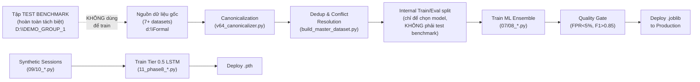

# Mô tả chi tiết quy trình Training — dựa trên code `d:\Formal`

> **Lưu ý quan trọng:** Toàn bộ dữ liệu trong `d:\Formal` **chỉ phục vụ training và calibration**. Tập test benchmark để báo cáo kết quả trong paper (29,038 records / AgentSynth 1,126 + AgentDojo 732) nằm **hoàn toàn riêng biệt** tại `D:\DEMO_GROUP_1` và không hề xuất hiện trong quá trình train.

---

## 1. Pipeline tổng quan

---

## 2. Chi tiết từng bước

### Bước 1: Thu thập nguồn dữ liệu (chỉ để train)

| Nguồn | Loại | Nhãn | Domain |
|---|---|---|---|
| `evopca_v6_master_data.csv` | Prompt injection + benign | dynamic (label column) | **Prompt** |
| `prompt_injection_dataset.csv` | Prompt injection | jailbreak → malicious, else benign | **Prompt** |
| `malignant.csv` | Multi-category | conversation → benign, else malicious | **Prompt** |
| `BIPIA_GPT` (HuggingFace) | Indirect prompt injection | dynamic (label column) | **Prompt** |
| `agent_task_test.jsonl` | Agent tasks (verified) | **benign** | **Prompt** |
| `attack_tools_test.jsonl` | Attack instructions (verified) | **malicious** | **Prompt** |
| `QuasarNix` (HuggingFace, `train/` + `test/`) | Shell/CLI attack commands | **malicious** | **Action** |
| `agent_malicious_augmented.csv` | Augmented malicious actions | **malicious** | **Action** |
| `AgentSynth_osworld.csv` | Benign OS-level tasks | **benign** | **Action** |
| `evo_pca_full.jsonl` | AgentDojo ground-truth actions | dynamic (priority=10) | **Action** |

> **Script:** [`build_master_dataset.py`](file:///d:/Formal/build_master_dataset.py), [`create_v65_prompt_data.py`](file:///d:/Formal/create_v65_prompt_data.py)

---

### Bước 2: Input Canonicalization

Mọi text đi qua [`v64_canonicalizer.py`](file:///d:/Formal/v64_canonicalizer.py):

| Rule | Ví dụ → Token |
|---|---|
| IP Address | `192.168.1.1:8080` → `<IP>` |
| IBAN | `DE89370400440532013000` → `<IBAN>` |
| UUID | `550e8400-e29b-41d4-...` → `<UUID>` |
| Hex Hash (32–64 char) | `a3f2b8c9d4...` → `<HASH>` |
| Sensitive Path | `/etc/shadow`, `~/.ssh/id_rsa` → `<SENSITIVE_PATH>` |

**Mục đích:** Buộc model học **pattern hành vi**, không overfitting trên literal value cụ thể.

---

### Bước 3: Deduplication & Conflict Resolution

**Script:** [`build_master_dataset.py`](file:///d:/Formal/build_master_dataset.py) dòng 109–152

1. **Exact Dedup:** MD5 hash trên canonicalized text → loại trùng hoàn toàn
2. **Fuzzy Dedup (v65):** Template normalization (lowercase, bỏ số/ký tự đặc biệt) → giữ tối đa **3 mẫu/template/label** → chống overfitting
3. **Conflict Resolution:** Cùng text, nhiều nguồn, nhãn khác nhau:
   - Ưu tiên nguồn priority cao nhất (`evo_pca_full.jsonl` = 10 > `attack_tools_test.jsonl` = 3 > các nguồn khác = 1–2)
   - Nếu tied priority mà vẫn xung đột nhãn → **DROP** (không dùng)

---

### Bước 4: Internal Train/Eval split (chỉ để chọn model)

> ⚠️ **Eval split ở đây KHÔNG phải tập test benchmark.** Nó chỉ dùng nội bộ để tính Brier Score, chọn model tốt nhất (ablation), và chạy quality gate. Kết quả báo cáo trong paper được đo trên tập benchmark hoàn toàn riêng biệt.

**V64 (Action + Prompt):**
- Split: **85% train / 15% internal eval** (random shuffle, seed=42)
- Stratified downsampling: `max_imbalance=10` (action), `max_imbalance=1` (prompt)

**V65 (Prompt mở rộng):**
- **GroupShuffleSplit** theo template group → tất cả biến thể cùng template nằm cùng 1 tập (chống data leakage nội bộ)
- 3 phần: **Train (~72%) / Internal Eval (~13%) / Holdout (~10,000 records)** — tất cả đều dùng cho training pipeline, không dùng báo cáo

---

### Bước 5: Training ML Ensemble

#### 5a. V64 Action + Prompt Model — [`07_phase2_retrain_v64.py`](file:///d:/Formal/07_phase2_retrain_v64.py)

| Thành phần | Chi tiết |
|---|---|
| Feature Extraction | TF-IDF, `max_features=30,000`, `ngram_range=(1,3)` |
| | Action model: custom `token_pattern` giữ shell metacharacters `/ - . \| > < & ;` |
| Base Classifier | `RandomForestClassifier(n_estimators=100, max_depth=20)` |
| Calibration | `CalibratedClassifierCV(cv=5, method='sigmoid')` — Platt scaling |
| Prior Shift Correction | Bayes odds correction: train prior → production prior (prompt: 5%, action: 1%) |
| Ablation | Action model train 2 lần (có/không `class_weight='balanced'`), chọn theo **Brier Score** thấp hơn |
| Đánh giá nội bộ | Weighted Brier Score (bootstrap 1000 iter, 95% CI) + Wilson CI cho FPR/TPR |

#### 5b. V65 Prompt Model — [`08_train_v65_prompt.py`](file:///d:/Formal/08_train_v65_prompt.py)

- Cùng kiến trúc TF-IDF + RF + CalibratedClassifierCV
- Dữ liệu mở rộng hơn v64 (thêm ToolBench, BIPIA, malignant.csv...)
- **Quality Gate tự động:** `F1(malicious) ≥ 0.85 AND FPR ≤ 5%` → pass mới save model, fail thì abort

#### 5c. Output Models

| Model file | Domain |
|---|---|
| `v64_prompt_risk_model.joblib` | Prompt |
| `v64_action_risk_model.joblib` | Action |
| `v65_prompt_risk_model.joblib` | Prompt (mở rộng) |

---

### Bước 6: Training Tier 0.5 Session-Level LSTM — [`11_phase8_train_tier_0_5.py`](file:///d:/Formal/11_phase8_train_tier_0_5.py)

| Thành phần | Chi tiết |
|---|---|
| Input | Synthetic session JSONL (từ `09_synthetic_session_gen.py` + `10_phase7_poc_dataset.py`) |
| Features/event | 3 chiều: `iat_ms`, `payload_bytes`, `content_risk_score` |
| Architecture | LSTM `hidden_dim=64`, `num_layers=2`, unidirectional |
| Loss | `BCEWithLogitsLoss` |
| Optimizer | Adam, `lr=0.001` |
| Training | 15 epochs, `batch_size=64`, PackedSequence (variable-length sessions) |
| Quality Gate | FPR < 5% trên internal eval set |
| Output | `v70_tier_0_5_session_risk.pth` |

---

## 3. Đoạn văn copy-paste vào file FAIR (mục V. Experimental Setup)

Chèn **trước** đoạn *"Six systems are compared..."*:

---

> ### A. ML Model Training Protocol
>
> **Data Sources and Canonicalization.** All ML classifier training data resides in a dedicated training repository, completely disjoint from both evaluation benchmarks (AgentSynth_osworld and AgentDojo v1). Training data for the Tier 2 ML classifiers is drawn from seven heterogeneous sources spanning the prompt and action (tool-call) domains. Prompt-domain sources include evopca_v6_master_data (general prompt injection), prompt_injection_dataset (jailbreak-labeled), malignant.csv (multi-category), BIPIA_GPT (indirect prompt injection from context), and manually verified benign agent tasks and malicious attack instructions. Action-domain sources include QuasarNix (shell/CLI attack commands), agent_malicious_augmented (augmented malicious actions), AgentSynth_osworld (benign OS-level tasks used only for training, not for the evaluation benchmark of the same name), and ground-truth tool-call records from AgentDojo execution traces.
>
> All text inputs undergo canonicalization prior to feature extraction: IP addresses, UUIDs, IBAN numbers, hex hashes, and sensitive file paths are replaced with typed placeholder tokens (e.g., `<IP>`, `<SENSITIVE_PATH>`), forcing the classifier to learn behavioral patterns rather than memorizing literal values.
>
> **Deduplication and Conflict Resolution.** Exact deduplication (MD5 hash on canonicalized text) removes identical records. Fuzzy deduplication via template normalization (lowercasing, number/special-character removal) retains at most three samples per template-label pair to prevent overfitting on paraphrased variants. When multiple sources assign conflicting labels to the same canonicalized text, the record from the highest-priority source is retained; if tied sources still disagree, the record is dropped entirely.
>
> **Internal Train/Eval Splits (for model selection only).** Within the training data, an internal eval split (15% for v64; GroupShuffleSplit for v65) is reserved solely for ablation studies and quality gate checks during training. This internal eval set is never used for reporting benchmark results — all metrics in Tables III–IV are computed exclusively on the held-out test benchmarks.
>
> **Model Architecture.** Both prompt and action models share the same architecture: TF-IDF vectorization (30,000 features, unigram-to-trigram) feeding a RandomForestClassifier (100 trees, max depth 20) wrapped in CalibratedClassifierCV (5-fold, sigmoid/Platt scaling). Bayesian prior-shift correction adjusts calibrated probabilities from training class ratios to assumed production priors (5% for prompts, 1% for actions). An ablation comparing class_weight='balanced' vs. unweighted training selects the variant with the lower weighted Brier score (bootstrap, 1,000 iterations, 95% CI).
>
> **Quality Gate.** Before deployment, each trained model must pass an automated quality gate requiring F1-score on the malicious class ≥ 0.85 AND False Positive Rate ≤ 5% on the internal eval set. Models failing this gate are rejected and not saved to production.
>
> **Tier 0.5 Session-Level LSTM.** A separate 2-layer LSTM (hidden dim=64, BCEWithLogitsLoss, Adam lr=0.001) is trained on synthetic session sequences. Each event is a 3-dimensional feature vector (inter-arrival time, payload size, content risk score). The LSTM processes variable-length sessions via PackedSequence and is trained for 15 epochs (batch size 64), subject to the same FPR < 5% quality gate.
>
> **Calibration Set Summary.** All pipeline hyperparameters listed in Table II — including decision thresholds, asymmetric learning rates α⁺/α⁻, FPR budget target B, and VotingAggregator score boundaries — are tuned exclusively on training data. No calibration-set record appears in either evaluation benchmark.

---

## 4. Bảng tóm tắt script → data → model

| Script | Input | Output | Vai trò |
|---|---|---|---|
| [`build_master_dataset.py`](file:///d:/Formal/build_master_dataset.py) | 7+ raw datasets | `v64_*_train.csv`, `v64_*_eval.csv` | Gộp, dedup, resolve, split nội bộ |
| [`create_v65_prompt_data.py`](file:///d:/Formal/create_v65_prompt_data.py) | v64 baseline + 6 nguồn | `v65_prompt_*_clean.csv`, `v65_prompt_holdout.csv` | Mở rộng prompt, GroupShuffleSplit |
| [`07_phase2_retrain_v64.py`](file:///d:/Formal/07_phase2_retrain_v64.py) | `v64_*_train.csv` | `v64_*_risk_model.joblib` | Train prompt + action ensemble |
| [`08_train_v65_prompt.py`](file:///d:/Formal/08_train_v65_prompt.py) | `v65_prompt_train_clean.csv` | `v65_prompt_risk_model.joblib` | Train prompt v65 + quality gate |
| [`data_quality_gate.py`](file:///d:/Formal/data_quality_gate.py) | Any CSV/JSONL | Pass/Fail | Domain leakage + ESS check |
| [`v64_canonicalizer.py`](file:///d:/Formal/v64_canonicalizer.py) | Raw text | Canonicalized text | Normalize IP/UUID/hash/path |
| [`11_phase8_train_tier_0_5.py`](file:///d:/Formal/11_phase8_train_tier_0_5.py) | `tier_0_5_*_sessions_*.jsonl` | `v70_tier_0_5_session_risk.pth` | Train session LSTM |
